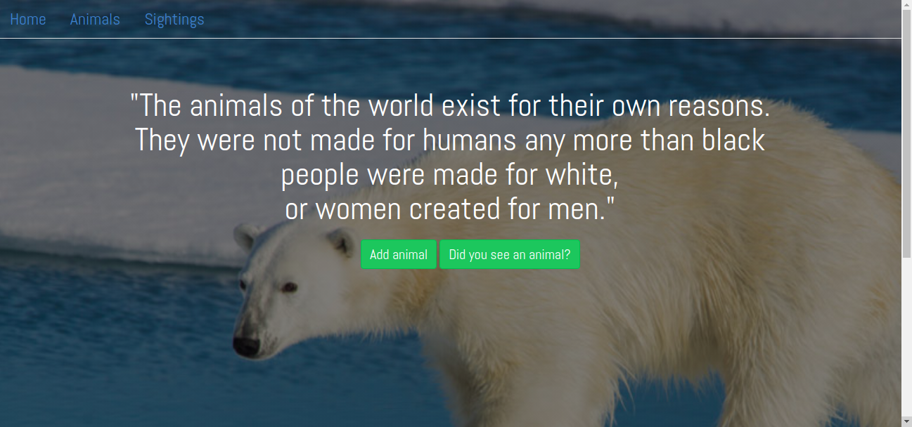

# Wildlife_Tracker_App2

## Written by

- Mugengano Alice 

Below is My app entry 

## Description
this is an App that helps animals to be know and to get help from rangers,here by the rangers
 in the park are in charge of reporting any animal found in the park because there are some rare animals that
  are growing to be few so tha is why we need t help them to not die but survive.
## BDD

- We were asked to make an application where the user will be able to report an animal
 he/she saw in the park and the fill the form to communicate the animal he saw and also
  will be able to specify if the animal is endanger meaning the it is in the lst species or
   reducing and also report the normal animals.And all these will be achieved by filling the
    form,and for the ones in charge they will be able to help the animal depending on it's condition  
## Application setup

- Use this link to access to the  app git repository [wildlife tracker](https://github.com/Mugengano18/Wildlife_Tracker_App2/tree/simple_code)
- I created also the database to Enter in my tables:

the tables are animals which will store all the animals and the one of rangers to store all the relevant information

## Technologies used

- Java
- Handlebars
- Spark framework
- Postgres
- CSS
## Contacts

- Email:mugenganoa@gmail.com

## MIT License

Copyright (c) 2019 Mugengano18

Permission is hereby granted, free of charge, to any person obtaining a copy of this software
and associated documentation files (the "Software"), to deal in the Software without restriction,
including without limitation the rights to use, copy, modify, merge, publish, distribute, sublicense,
and/or sell copies of the Software, and to permit persons to whom the Software is furnished to do so,
subject to the following conditions:

The above copyright notice and this permission notice shall be included in all
copies or substantial portions of the Software.

THE SOFTWARE IS PROVIDED "AS IS", WITHOUT WARRANTY OF ANY KIND, EXPRESS OR IMPLIED,
INCLUDING BUT NOT LIMITED TO THE WARRANTIES OF MERCHANTABILITY, FITNESS FOR A PARTICULAR PURPOSE AND NONINFRINGEMENT.
IN NO EVENT SHALL THE AUTHORS OR COPYRIGHT HOLDERS BE LIABLE FOR ANY CLAIM, DAMAGES OR OTHER LIABILITY, WHETHER IN AN ACTION
OF CONTRACT, TORT OR OTHERWISE, ARISING FROM, OUT OF OR IN CONNECTION WITH THE SOFTWARE OR THE USE OR OTHER DEALINGS IN THE 
SOFTWARE.
